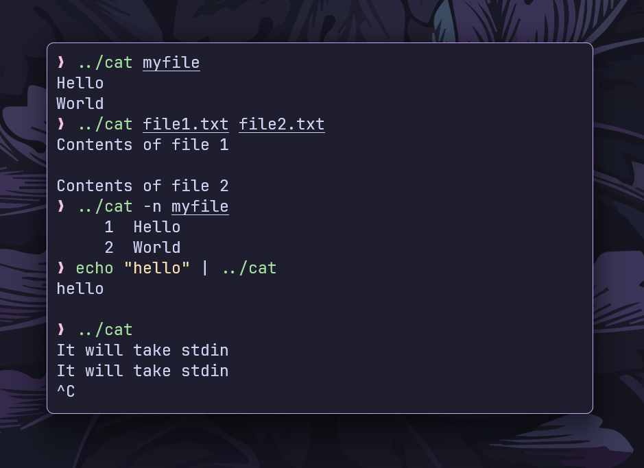

# `cat` command

This is a simplified implementation of the `cat` command in the Go programming language.



## Features

- **Basic File Output:** Prints the contents of files.
- **Multiple File Support:** Concatenates multiple files.
- **Stdin Support:** Reads from standard input if no file is provided.
- **Line Numbering (`-n`):** Displays line numbers before each line.

## Installation

```bash
git clone https://github.com/ashish0kumar/gonix.git
cd gonix/cmd/cat
go build cat.go
```

## Usage

- **Basic File Output**

    `./cat file.txt`

    Prints the contents of `file.txt`

- **Concatenate Multiple Files**

    `./cat file1.txt file2.txt`

    Displays contents of both files sequentially.

- **Read from Stdin**

    `echo "Hello, World!" | ./cat`

    Prints `Hello, World!` from standard input.

- **Line Numbering (-n)**

    `./cat -n file.txt`

    Displays each line with its corresponding line number.