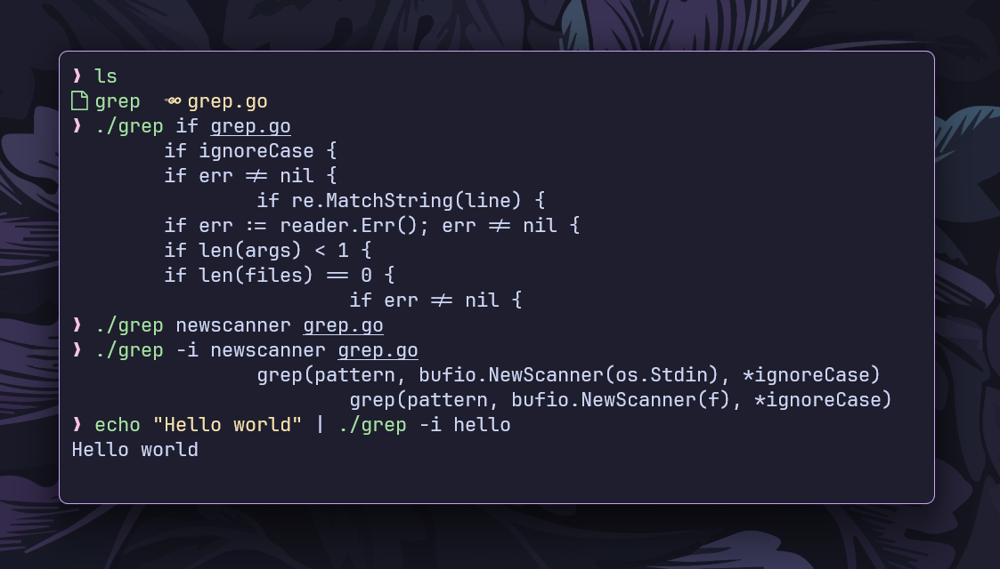

# `grep` Command

This is a simplified implementation of the `grep` command in the Go programming
language.



## Features

- **Basic Pattern Matching:** Searches for a given pattern in a file.
- **Case-Insensitive Search (`-i`):** Enables case-insensitive matching.
- **Multiple File Support:** Can search in multiple files.
- **Standard Input Support:** Reads from stdin if no file is provided.

## Installation

```bash
git clone https://github.com/ashish0kumar/gonix.git
cd gonix/cmd/grep
go build grep.go
```

## Usage

- **Basic Pattern Search**

  `./grep "hello" file.txt`

  Searches for "`hello`" in `file.txt` and prints matching lines.

- **Case-Insensitive Search (`-i`)**

  `./grep -i "hello" file.txt`

  Matches "`hello`", "`Hello`", "`HELLO`", etc.

- **Multiple Files**

  `./grep "error" file1.txt file2.txt`

  Searches for "`error`" in both file1.txt and file2.txt.

- **Using Standard Input**

  `echo "Hello world" | ./grep -i "hello"`

  Reads from stdin and prints matching lines.
