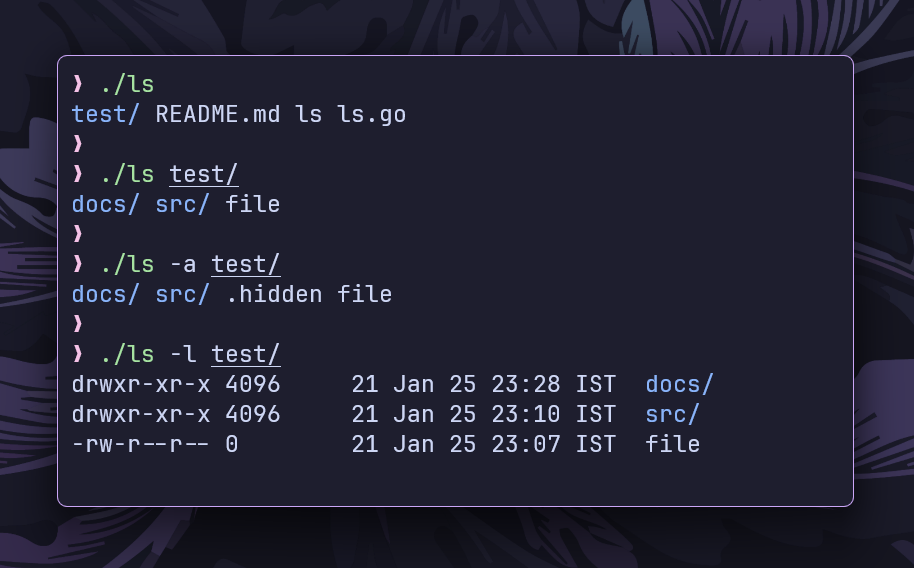

# `ls` command

This is a simplified implementation of the `ls` command in the Go Programming
language.



## Features

- **Basic Listing:** Lists files and directories.
- **Hidden Files (`-a`):** Includes hidden files (those starting with .).
- **Detailed Listing (`-l`):** Shows file permissions, size, and modification
  time.
- **Directory First:** Directories are listed before files in all modes.
- **Blue-colored Directories:** Directories are displayed in blue to
  differentiate them from regular files.

## Installation

```bash
git clone https://github.com/ashish0kumar/gonix.git
cd gonix/cmd/ls
go build ls.go
```

## Usage

- **Basic Listing**

  `./ls`

  Lists files and directories in the current directory. Directories are listed
  first, followed by files.

- **With Directory Argument**

  `./ls [directory]`

  Lists the contents of the specified directory. If no directory is specified,
  the current directory is used by default.

- **With `-a` (Show Hidden Files)**

  `./ls -a`

  Includes hidden files (those starting with .) in the listing.

- **With `-l` (Detailed Listing)**

  `./ls -l`

  Displays detailed information about files and directories, including:

  - Permissions
  - Size
  - Modification time
