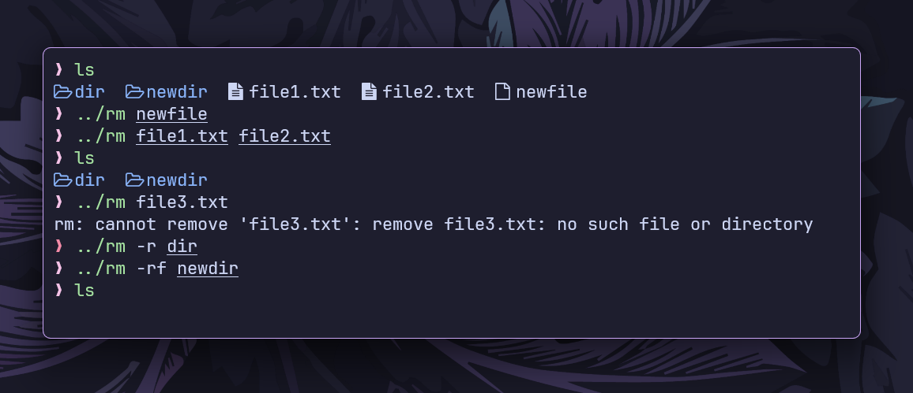

# `rm` command

This is a simplified implementation of the `rm` command in the Go programming
language.



## Features

- **Basic File Removal:** Deletes files from the filesystem.
- **Recursive Deletion (`-r`):** Removes directories and their contents
  recursively.
- **Force Mode (`-f`):** Suppresses errors if files do not exist.
- **Combination (`-rf`):** Recursively and forcefully deletes directories and
  files.

## Installation

```bash
git clone https://github.com/ashish0kumar/gonix.git
cd gonix/cmd/rm
go build rm.go
```

## Usage

- **Basic File Removal**

  `./rm file.txt`

  Deletes `file.txt` if it exists.

- **Delete Multiple Files**

  `./rm file1.txt file2.txt`

  Deletes `file1.txt` and `file2.txt`

- **Recursive Directory Deletion (`-r`)**

  `./rm -r mydir`

  Deletes `mydir` and its contents.

- **Force Delete a File (`-f`)**

  `./rm -f file.txt`

  Suppresses errors if `file.txt` does not exist.

- **Force Delete a Directory (`-rf`)**

  `./rm -rf mydir`

  Deletes `mydir` and its contents without any errors.
