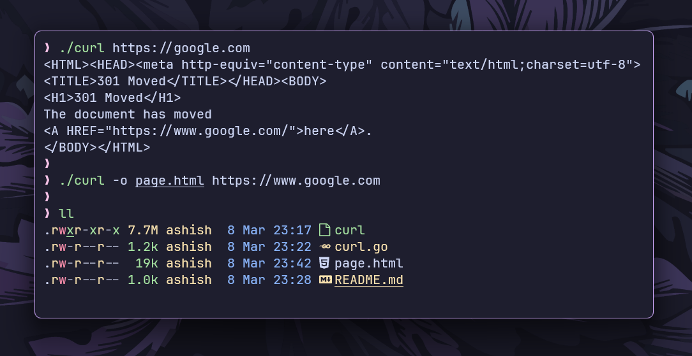

# `curl` command

This is a simplified implementation of the `curl` command in the Go programming language.



## Features

- **Fetch URL Content:** Downloads and prints the content of a given URL.
- **Follow Redirects (`-L`):** Automatically follows HTTP redirects.
- **Save Output to File (`-o`):** Saves the response to a specified file instead of printing it to stdout.

## Installation

- **Clone the repository:**

```bash
git clone https://github.com/ashish0kumar/gonix.git
```

- **Navigate to the curl subdirectory:**

```bash
cd gonix/curl
```

- **Build the Go program:**

```bash
go build curl.go
```

## Usage

- **Basic URL Fetch**

    `./curl https://example.com`

    Prints the content of `https://example.com` to the terminal.

- **Follow Redirects (`-L`)**

    `./curl -L http://example.com`

    Follows redirects and prints the final content.

- **Save Output to a File (`-o`)**

    `./curl -o page.html https://example.com`

    Saves the response to `page.html` instead of printing it.