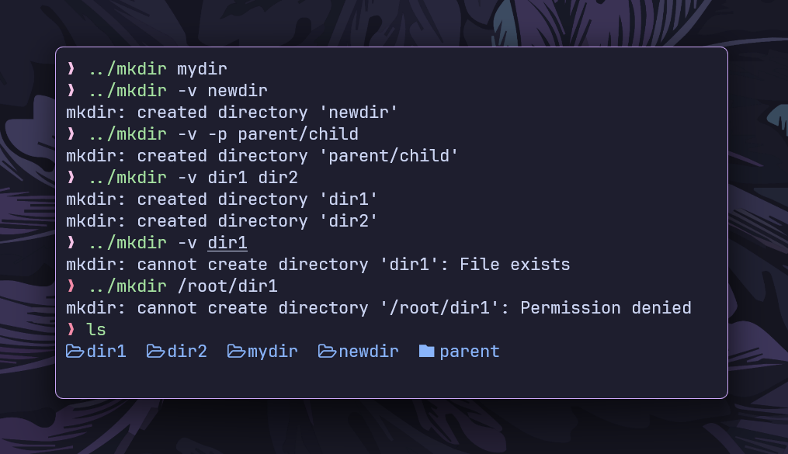

# `mkdir` command

This is a simplified implementation of the `mkdir` command in the Go programming language.



## Features

- **Basic Directory Creation:** Creates a new directory.
- **Parent Directories (`-p`):** Creates parent directories if they don’t exist.
- **Verbose Mode (`-v`):** Prints a message for each created directory.
- **Multiple Directories:** Supports creating multiple directories at once.

## Installation

- **Clone the repository:**

```bash
git clone https://github.com/ashish0kumar/gonix.git
```

- **Navigate to the mkdir subdirectory:**

```bash
cd gonix/mkdir
```

- **Build the Go program:**

```bash
go build mkdir.go
```

## Usage

- **Basic Directory Creation**

    `./mkdir mydir`

    Creates mydir in the current directory.

- **With `-p` (Create Parent Directories)**

    `./mkdir -p parent/child`

    Creates parent (if not existing) and child inside it.

- **With `-v` (Verbose Mode)**

    `./mkdir -v mydir`

    **Output:** `mkdir: created directory 'mydir'`

- **With `-p` and `-v` Together**

    `./mkdir -p -v parent/child`

    **Output:** `mkdir: created directory 'parent/child'`

- **Creating Multiple Directories**

    `./mkdir dir1 dir2 dir3`

    Creates dir1, dir2, and dir3.