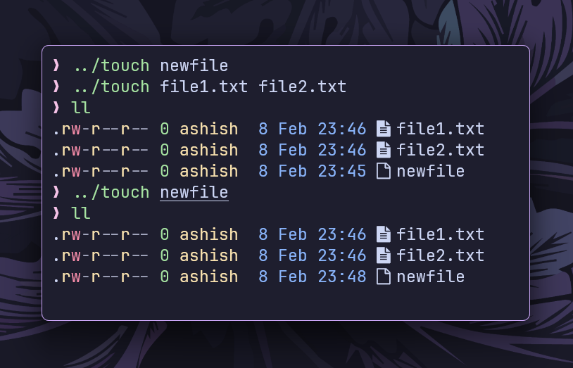

# `touch` command

This is a simplified implementation of the `touch` command in the Go programming language.



## Features

- **Create New Files:** Creates a file if it doesn’t exist.
- **Update Timestamps:** Updates modification time if the file already exists.
- **Multiple Files Support:** Can handle multiple files in a single command.

## Installation

- **Clone the repository:**

```bash
git clone https://github.com/ashish0kumar/gonix.git
```

- **Navigate to the touch subdirectory:**

```bash
cd gonix/touch
```

- **Build the Go program:**

```bash
go build touch.go
```

## Usage

- **Create a New File**

    `./touch newfile.txt`

    Creates `newfile.txt` if it doesn’t exist.

- **Update Timestamp of an Existing File**

    `./touch existing.txt`

    Updates the modification time of `existing.txt`

- **Create or Update Multiple Files**

    `./touch file1.txt file2.txt file3.txt`

    Creates `file1.txt`, `file2.txt`, and `file3.txt` if they don’t exist, or updates their timestamps if they do.