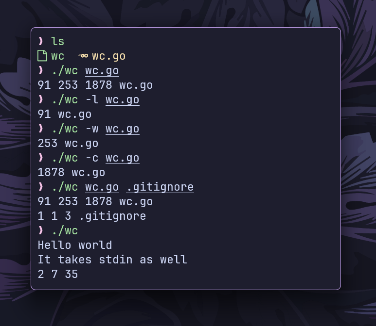

# `wc` command

This is a simplified implementation of the `wc` command in the Go programming language.



## Features

- **Line Count (`-l`):** Prints the number of lines.
- **Word Count (`-w`):** Prints the number of words.
- **Byte Count (`-c`):** Prints the number of bytes.
- **Multiple Files Support:** Can process multiple files and display their statistics.
- **Standard Input Support:** Reads from stdin if no file is provided.

## Installation

- **Clone the repository:**

```bash
git clone https://github.com/ashish0kumar/gonix.git
```

- **Navigate to the wc subdirectory:**

```bash
cd gonix/wc
```

- **Build the Go program:**

```bash
go build wc.go
```

## Usage

- **Basic Usage**

    `./wc file.txt`

    Outputs the number of lines, words, and bytes in `file.txt`

- **Count Lines (`-l`)**

    `./wc -l file.txt`

    Prints only the number of lines.

- **Count Words (`-w`)**

    `./wc -w file.txt`

    Prints only the number of words.

- **Count Bytes (`-c`)**

    `./wc -c file.txt`

    Prints only the number of bytes.

- **Multiple Files**

    `./wc file1.txt file2.txt`

    Displays line, word, and byte counts for each file separately.

- **Using Standard Input**

    `./wc`

    Accepts input from stdin and displays counts after pressing `Ctrl+D`